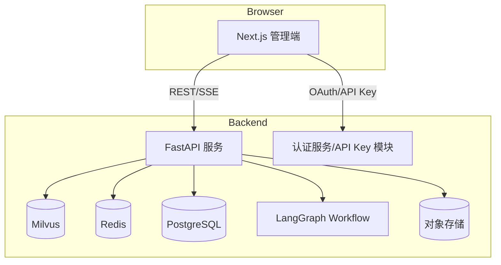

# 管理端前台界面设计方案

## 1. 背景与目标
- **现状**：后端已提供 OpenAI 兼容聊天接口、Milvus/Redis 支撑的 RAG 能力，以及知识库上传与检索 API，但缺少统一的运营管理界面。
- **目标**：构建仅面向管理员的 Web 管理端，用于知识库维护、模型配置、会话监控、系统健康和接入管理，保障业务方可独立运营与调优。
- **成功指标**：
  1. 运营人员可在 5 分钟内完成文档上传并确认检索效果。
  2. 关键系统指标（Milvus、Redis、LLM）状态在界面内实时可见，故障发现时间 < 2 分钟。
  3. 支持至少 3 个角色分级权限管理，敏感操作均有审计记录。

## 2. 范围与约束
### 2.1 范围
- 前端仅实现管理端，不包含访客聊天组件。
- 功能模块：知识库维护、模型与对话配置、会话审查、系统健康与运营数据、接入配置、权限与账号体系。
- 结合后端现有 API，无需新增服务，但可补充必要的管理端专用 API（如权限、审计日志）。

### 2.2 非目标
- 不实现终端用户聊天体验。
- 不负责后端服务部署编排，仅提供状态展示与配置入口。
- 不构建复杂的可视化 BI，大盘以核心指标卡片+趋势图为主。

### 2.3 约束
- 与现有 FastAPI 服务同域部署，复用现有认证机制（API Key / Token）。
- UI 框架需支持服务端渲染或静态导出，便于集成至已有站点。
- 必须遵守项目约定的文档与代码规范。

## 3. 角色与权限模型
| 角色 | 权限范围 | 典型操作 |
|------|----------|----------|
| **Admin** | 全量模块访问，包含系统配置与权限管理 | 创建/禁用账号、调整模型别名、查看审计日志 |
| **Operator** | 知识库、会话、监控模块的读写权限 | 上传文档、查看对话详情、导出统计 |
| **Auditor** | 只读权限（可查看所有页面但无编辑能力） | 查看会话记录、导出报表 |

- 权限粒度采用 **RBAC**：页面级 + 功能级按钮权限（例如“接管会话”、“生成 API Key”）。
- 关键操作（删除文档、变更模型路由、生成 API Key）必须二次确认并写入审计日志。

## 4. 前端技术选型
| 层级 | 技术栈 | 选型理由 |
|------|--------|----------|
| 框架 | Next.js 14 (App Router) + TypeScript | 具备 SSR/SSG 能力，便于部署与 SEO；TypeScript 提供类型安全 |
| UI 组件 | Ant Design v5 | 快速搭建后台界面，生态成熟，内置数据表格/表单 |
| 状态管理 | React Query + Zustand | React Query 处理远程数据缓存与请求重试；Zustand 用于全局 UI 状态（主题、侧栏折叠） |
| 样式 | Tailwind CSS + AntD 自定义主题 | 保持设计一致性并快速实现响应式 |
| 图表 | ECharts (通过 `echarts-for-react`) | 满足指标趋势图需求 |
| 构建/部署 | Vercel Adapter 或静态导出至 Nginx | 保持与主站部署方式兼容 |

## 5. 系统架构


- 前端通过统一的 `/api` 代理与后端交互，复用现有身份认证。
- 对象存储用于上传原始文档（如需大文件），默认可使用现有站点的 OSS/S3。

## 6. 页面信息架构
1. **Dashboard（仪表盘）**：展示系统概况、模型别名、Milvus/Redis 状态、错误率折线图。
2. **Knowledge Base**：
   - 文档列表（表格 + 标签筛选 + 版本展示）
   - 文档上传向导（支持 Markdown/HTML/纯文本）
   - 检索调试面板（输入 Query → 展示命中片段及相似度）
3. **Conversations**：
   - 会话列表（支持搜索、按时间/用户过滤）
   - 会话详情（气泡视图、命中知识片段标记、访客反馈）
   - 人工介入（追加回复、标记处理结果）
4. **Model & Routing**：
   - 模型别名管理（别名、真实模型、温度、Top-p）
   - 系统提示词编辑器（版本历史）
   - 会话策略开关（RAG、缓存、流式输出）
5. **Integrations**：
   - API Key 管理（生成、吊销、权限范围）
   - WordPress 接入向导（步骤说明 + 配置示例 + 自检按钮）
   - 模拟调用工具（发起 `/v1/chat/completions` 示例请求）
6. **Monitoring & Audit**：
   - 指标趋势（对话量、知识命中率、响应时间）
   - 系统状态（健康检查结果、报警阈值配置）
   - 审计日志（按用户/操作类型过滤）
7. **Settings**：
   - 账号与角色管理
   - SSO/LDAP 配置（可选）
   - 界面个性化设置（主题、语言）

### 6.1 页面级交互细节
- **Dashboard**：
  - KPI 卡片默认展示最新 24 小时数据，支持下拉切换 7/30 天区间；每张卡片提供“查看详情”按钮跳转到 Monitoring & Audit。
  - 指标折线图提供区域缩放与游标，Hover 时展示原始值、同比、环比，空数据状态显示“暂无数据”占位与刷新按钮。
- **Knowledge Base**：
  - 表格列包含“版本”、“片段数”、“发布状态”，支持行内“预览”操作，以 Drawer 展示文档元数据与最近一次检索命中。
  - 上传向导分三步：选择文件→补充元信息→预览摘要；每一步提交前执行前端校验并允许保存为草稿。
- **Conversations**：
  - 会话列表默认根据最近活跃排序，提供“是否命中知识库”“是否人工介入”过滤；对话详情支持时间线视图与原始 JSON 下载。
  - 人工追加消息需填写原因，提交后在消息流中以“人工修订”标签区分。
- **Model & Routing**：
  - 列表支持批量启停别名；表单内提供实时调用 `/v1/models` 的可用性校验结果与耗时。
  - 系统提示词编辑器采用 Monaco Editor，支持版本对比与一键回滚。
- **Integrations**：
  - API Key 列表仅展示部分明文（前 4 后 4），其余以掩码处理；生成成功后弹窗告知仅显示一次。
  - WordPress 引导包含交互式步骤条，并在每步右侧展示对应的示例截图/代码片段。
- **Monitoring & Audit**：
  - 图表支持指标勾选开关，默认展示对话量与知识命中率；异常检测命中时在卡片右上角显示红色 Badge。
  - 审计列表支持导出 CSV，并提供字段级搜索（操作者、操作类型、时间区间、关联资源）。
- **Settings**：
  - 角色管理页面提供“克隆角色”能力便于快速配置；支持权限矩阵导出。
  - 个性化设置直接写入用户偏好表（PostgreSQL），并同步至 Zustand store。

### 6.2 视觉与交互风格
- **整体调性**：采用现代化企业后台风格，基于 Ant Design 自定义“深蓝 + 中性色”主题，主色（Primary）为 `#2952FF`，辅色（Info）为 `#3BA3FF`，告警与成功状态沿用 AntD 预设色值但降低饱和度以增强可读性。
- **布局结构**：使用双栏布局（左侧 264px 折叠导航 + 右侧内容区），顶部保留 56px 固定操作条，支持 Breadcrumb 与全局搜索。内容区以 16px 栅格间距组织 Card 与表格，保持信息密度与留白平衡。
- **色彩与层级**：背景采用 `#0F172A` → `#111827` 渐变营造沉浸感，内容卡片使用 `#1F2937` 半透明背景与 8px 圆角。高亮模块（如 KPI 卡片）叠加线性渐变描边，Hover 与 Focus 状态通过 4px 投影和明度提升 6% 体现。
- **字体与排版**：默认字体为 `"Inter", "PingFang SC", sans-serif`，标题字号 `24/20/16` 等差递减，正文 14px，辅助信息 12px。行高保持 1.6，数字指标使用 Tabular Numbers 以便对齐。
- **图表语言**：ECharts 统一采用深色主题，线图使用主色与辅色双线，柱状图辅以渐变填充并在 Tooltip 中展示百分比。所有图表需含更新时间戳与空数据兜底文案。
- **交互反馈**：
  - 表单提交、批量操作等耗时动作使用右下角全局通知；危险操作弹出带红色强调按钮的二次确认 Modal。
  - 列表 Hover 与选中采用 2px 左侧色条提示；表格支持密度切换（默认中等）。
  - 暗色模式为默认主题，提供设置项切换为亮色（继承 AntD Light Theme）以兼顾不同办公环境。
- **响应式**：宽度 < 1280px 时左侧导航自动折叠，仅保留图标；< 768px 时切换为抽屉式导航，关键 KPI 卡片与监控图表采用单列纵向排列，确保平板设备可用。
- **可访问性**：保证主色与背景对比度 ≥ 4.5:1，表单控件提供可感知的 Focus Ring；图标均附带文字标签或 Tooltip，支撑键盘导航与屏幕阅读器。

## 7. 核心流程设计
### 7.1 登录与权限校验
1. 用户访问管理端 → 如果未登录则跳转至登录页。
2. 调用 `/api/v1/auth/session` 校验 Token 或 API Key。
3. 获取用户角色与权限集合，缓存于 React Query。
4. 依据权限动态生成菜单和按钮。

### 7.2 文档上传流程
1. 运营在“Knowledge Base > 上传”选择文件或粘贴文本。
2. 前端完成格式校验（大小、类型），如大文件则上传至对象存储并获取临时 URL。
3. 调用 `/api/v1/knowledge/upsert`，传入文档文本/URL、metadata（标题、分类、标签、版本）。
4. 成功后刷新文档列表并在通知区提示切片统计。
5. 写入审计日志：`document_upsert`，包含操作者、文档 ID、版本号。

### 7.3 检索调试流程
1. 用户输入查询语句，调用 `/api/v1/knowledge/search`。
2. 展示命中文档、相似度、片段高亮，并支持“跳转到原文”。
3. 可选择“复制为提示词”用于人工干预回复。

### 7.4 模型别名配置
1. 管理员在“Model & Routing”中编辑别名表单。
2. 表单提交调用 `/api/v1/models/aliases`（需新增管理端接口）。
3. 后端验证模型存在性、更新配置存储（可存储于 Redis/数据库）。
4. 成功后触发配置刷新并记录审计日志 `model_alias_update`。

### 7.5 会话审查与人工介入
1. 会话列表调用 `/api/v1/conversations`（需新增），支持分页与过滤。
2. 详情页调用 `/api/v1/conversations/{id}`，展示消息流与命中知识片段。
3. 对于人工追加回复，调用 `/api/v1/conversations/{id}/messages`（POST），消息标记来源为 `human_override`。
4. 所有人工介入写入审计日志，并与原会话关联。

### 7.6 系统监控
1. 仪表盘调用 `/api/v1/health`、`/api/v1/metrics`（需新增，聚合对话量、错误率、响应时间）。
2. 支持设置阈值并在前端触发高亮或通知。
3. 长连接/轮询间隔 30s，必要时采用 SSE 推送。

### 7.7 API Key 管理
1. 管理员生成 API Key → 调用 `/api/v1/auth/api-keys`（POST），返回一次性明文。
2. 支持设置可访问模块、有效期、限流阈值。
3. 吊销/刷新 Key → `DELETE /api/v1/auth/api-keys/{id}` 或 `POST /api/v1/auth/api-keys/{id}/rotate`。
4. 重要操作写入审计日志并提示用户安全保存。

## 8. 数据模型与存储
### 8.1 前端本地数据结构
- `UserSession`: `{ id, name, roles: Role[], permissions: string[], token }`
- `Document`: `{ id, title, category, tags, version, updated_at, source_url, status }`
- `Conversation`: `{ id, user_label, created_at, summary, has_feedback, messages[] }`
- `AuditLog`: `{ id, actor, action, target, metadata, created_at }`

### 8.2 后端配合需求
- 新增管理端专用 API：
  - `/api/v1/models/aliases` (GET/PUT)
  - `/api/v1/conversations` & `/api/v1/conversations/{id}`
  - `/api/v1/audit-logs`
  - `/api/v1/auth/api-keys`
  - `/api/v1/metrics`（聚合统计）
- 引入 **PostgreSQL** 作为结构化数据的权威存储，用于权限、配置版本、审计日志、API Key 元数据等需要事务保证与灵活查询的场景；仅在 PoC 阶段可短暂通过 Redis Stream 过渡，正式上线必须落地至关系型库，以满足数据一致性与合规审计要求。
- 文档版本信息可存储在 Milvus metadata 或附加到对象存储索引。

### 8.3 存储职责划分
| 数据类型 | 存储介质 | 说明 |
|----------|----------|------|
| 知识库向量、召回片段 | Milvus | 支撑相似度检索，继续沿用现有向量库结构 |
| 会话缓存、短期状态 | Redis | 服务 LangGraph 工作流与速率限制 |
| 审计日志、权限、配置版本、API Key 元信息 | PostgreSQL | 需要事务、历史追踪与复杂筛选，提供长期留存能力 |
| 原始文档文件 | 对象存储 | 统一存放上传的 Markdown/HTML 等文件，支持断点续传 |

## 9. 状态管理与缓存策略
- React Query：
  - `staleTime` 默认 30s，知识库与会话列表 5s，配置类 5min。
  - 启用后台刷新与错误重试（指数退避，最多 3 次）。
- 本地缓存：使用 IndexedDB (via `idb`) 缓存近期会话，提升翻页体验。
- SSE/WS：会话详情页支持监听后端流式事件（如人工介入通知），采用 EventSource。

## 10. 安全与合规
- 所有 API 请求需携带 Bearer Token，敏感操作附带 `X-Request-Id` 便于审计。
- 上传文件前在前端计算 SHA-256 用于重复检测。
- 防止 XSS：对富文本展示使用 `DOMPurify`，并在后端进行 HTML 清洗。
- CSRF：使用 `SameSite=strict` Cookie 或使用 Token + Header 认证。
- 审计：所有配置变更写入 `/api/v1/audit-logs`，包含操作者、时间、IP。

### 10.1 错误处理与回退策略
- **前端提示级别**：
  - `info`：操作成功但存在警告（例如部分文档切片失败），以全局通知提示并附详情链接。
  - `warning`：可恢复错误（如网络重试中），通过顶部 Alert 与自动重试倒计时提醒。
  - `error`：不可恢复错误（权限不足、服务器故障），展示带错误码的对话框并支持复制请求 ID 给支持团队。
- **重试策略**：所有关键 API（上传、配置保存、会话接管）启用幂等 token，失败时提供“重试”与“回滚到上一个版本”按钮。
- **降级方案**：
  - 指标服务不可用时，Dashboard 展示静态占位与最近一次成功时间戳。
  - 审计日志失效时触发只读模式并提醒管理员导出本地操作记录。
- **客户端日志**：引入 `@sentry/nextjs` 记录前端异常，日志中带上用户角色、浏览器信息与相关 API 响应摘要。

## 11. 性能与可用性
- 页面加载：利用 Next.js SSG 为静态页面（登录、文档）预渲染，动态数据通过客户端请求。
- 大文件上传使用分片 + 并发控制，显示进度条。
- 指标大盘使用延迟加载与虚拟化列表，避免一次性渲染过多图表。
- 灰度发布：通过环境变量控制新功能开关（Feature Flag）。

## 12. 部署方案
1. 构建：`next build && next export` 输出静态文件，或 `next build` + Node 服务器。
2. 部署模式：
   - **静态部署**：Nginx/OSS 托管静态资源，通过反向代理转发 `/api`。
   - **Serverless**：部署至 Vercel/Netlify，配置环境变量与 API 代理。
3. CI/CD：
   - 复用现有 GitHub Actions，新增前端构建与 `eslint`/`typecheck` 步骤。
   - 发布前运行端到端测试（Playwright）验证关键流程。

## 13. 开发计划
| 迭代 | 时长 | 核心交付 |
|------|------|----------|
| Sprint 1 | 2 周 | Next.js 项目初始化、身份认证、基础布局与菜单 |
| Sprint 2 | 2 周 | 知识库模块（文档列表、上传、检索调试） |
| Sprint 3 | 2 周 | 会话审查、模型配置页面、审计日志接入 |
| Sprint 4 | 2 周 | 监控仪表盘、API Key 管理、WordPress 接入向导 |
| Sprint 5 | 1 周 | 性能优化、可用性测试、上线准备 |

## 14. 风险与缓解
| 风险 | 影响 | 缓解策略 |
|------|------|-----------|
| 后端缺少部分管理接口 | 功能阻塞 | 提前确认 API 需求，优先交付必要的只读接口；临时使用 Mock 服务加速前端开发 |
| 大文件上传导致超时 | 影响用户体验 | 限制单文件大小（默认 10MB），超出时要求离线导入；采用断点续传 |
| 指标数据延迟 | 仪表盘准确性下降 | 后端引入缓存或时序数据库；前端明确标注数据更新时间 |
| 权限控制不当 | 数据泄露风险 | 实现后端接口级鉴权 + 前端路由守卫，编写安全测试用例 |

## 15. 后续扩展
- 与企业 SSO（如 OAuth2、LDAP）对接。
- 支持工作流审批（如知识库变更需双人审核）。
- 增加多租户能力，按站点/品牌隔离数据。
- 集成 A/B 测试面板，快速验证不同提示词策略效果。

## 16. 仓库目录规划
- 在现有后端项目根目录下新增 `apps/admin-console/` 作为前端代码根目录，使用 Next.js App Router 结构：
  - `apps/admin-console/app/`：页面路由与布局（`(dashboard)`, `(auth)` 等分组）。
  - `apps/admin-console/components/`：Ant Design 封装组件与通用 UI 模块。
  - `apps/admin-console/features/`：按业务模块（knowledge-base、conversations、monitoring 等）划分的逻辑与 hook。
  - `apps/admin-console/services/`：封装对 FastAPI 的 API Client、React Query keys 与数据模型。
  - `apps/admin-console/public/`：静态资源（图标、插图、manifest）。
  - `apps/admin-console/tests/`：前端端到端与组件测试（Playwright、Vitest）。
- 公共配置（`tsconfig`, `eslint`, `tailwind.config.js`）放置于 `apps/admin-console/` 内部，必要时在仓库根目录新增对应的 workspace 配置文件（如 `package.json`, `pnpm-workspace.yaml`），确保与 Python 后端互不影响。
- 版本化静态资源（如图标）统一放入 `apps/admin-console/public/assets/<module>/`，同时在 `apps/admin-console/public/meta/manifest.json` 中登记版本号，保障缓存刷新。
- 前端环境变量通过 `apps/admin-console/.env.example` 声明，采用 `NEXT_PUBLIC_` 前缀暴露给浏览器；敏感配置（如 Sentry DSN）通过部署平台注入且不写入 Git。

## 17. 功能-接口映射
| 模块 | 前端入口 | 后端接口 | 请求方法 | 核心字段 | 成功响应摘要 | 失败场景处理 |
|------|----------|----------|----------|----------|---------------|---------------|
| Dashboard 指标 | `/dashboard` | `/api/v1/metrics` | GET | `range`, `metrics[]` | `{ data: { totals, trends[] }, generated_at }` | 指标服务 5xx → 显示“指标服务暂不可用”并记录 Sentry | 
| Milvus 状态卡片 | `/dashboard` | `/api/v1/health` | GET | `component` | `{ status: "healthy", latency_ms }` | 返回超时 → 标红卡片并触发 60s 重试 |
| 文档列表 | `/knowledge-base` | `/api/v1/knowledge/list`* | GET | `page`, `filters` | `{ items: Document[], total }` | 403 → 跳转无权限页；网络失败 → 表格显示重试按钮 |
| 文档上传 | `/knowledge-base/upload` | `/api/v1/knowledge/upsert` | POST | `content`, `metadata`, `source_url` | `{ document_id, chunk_count }` | 校验失败 → 高亮对应表单项并展示后端 `error_detail` |
| 检索调试 | `/knowledge-base/search` | `/api/v1/knowledge/search` | POST | `query`, `top_k` | `{ matches: [{ id, score, snippet }] }` | 无命中 → 提示“未检索到相关片段”，记录查询日志 |
| 会话列表 | `/conversations` | `/api/v1/conversations` | GET | `page`, `filters` | `{ items: ConversationSummary[], total }` | SSE 断线 → 显示断线提示与手动刷新 |
| 会话详情 | `/conversations/[id]` | `/api/v1/conversations/{id}` | GET | `include_messages` | `{ conversation, messages[] }` | 404 → 展示“会话不存在或已删除” |
| 人工介入 | `/conversations/[id]` | `/api/v1/conversations/{id}/messages` | POST | `content`, `reason`, `attachments` | `{ message_id, created_at }` | 审批失败 → 弹出审批流程说明 |
| 模型别名配置 | `/model-routing` | `/api/v1/models/aliases` | GET/PUT | `aliases[]`, `validate=true` | `{ aliases: Alias[] }` | 后端校验失败 → 展示冲突模型并阻止提交 |
| API Key 管理 | `/integrations/api-keys` | `/api/v1/auth/api-keys` | GET/POST/DELETE | `label`, `scopes`, `expires_at` | `{ id, masked_key, created_at }` | 吊销失败 → 重试并提示联系 Admin |
| 审计日志 | `/monitoring/audit` | `/api/v1/audit-logs` | GET | `actor`, `action`, `from`, `to` | `{ items: AuditLog[], total }` | 数据库延迟 → 表格顶部提示“数据同步延迟 <5min” |

> `*` `/api/v1/knowledge/list` 需在后端新增，或在 `/api/v1/knowledge/upsert` 中补充 `GET` 列表能力。

### 17.1 请求示例
```json
POST /api/v1/models/aliases
{
  "aliases": [
    {
      "name": "default-assistant",
      "provider_model": "gpt-4o-mini",
      "temperature": 0.2,
      "top_p": 0.95,
      "rag_enabled": true
    }
  ],
  "validate": true
}
```

```json
200 OK
{
  "aliases": [
    {
      "name": "default-assistant",
      "provider_model": "gpt-4o-mini",
      "status": "active",
      "validated_at": "2024-07-09T03:21:00Z"
    }
  ]
}
```

## 18. 数据库表设计（PostgreSQL）
| 表名 | 关键字段 | 说明 |
|------|----------|------|
| `users` | `id (UUID)`, `email`, `display_name`, `status`, `last_login_at` | 存储管理端账号信息，与现有认证服务同步或定时对账 |
| `roles` | `id`, `name`, `description`, `permissions (JSONB)` | 定义角色及权限集合，权限以模块+动作编码表示 |
| `user_roles` | `user_id`, `role_id`, `assigned_by`, `assigned_at` | 用户与角色的多对多关联，支持审计操作者 |
| `api_keys` | `id`, `label`, `hashed_key`, `scopes (JSONB)`, `expires_at`, `created_by` | API Key 元数据与权限范围，实际密钥加盐哈希存储 |
| `audit_logs` | `id`, `actor_id`, `action`, `target_type`, `target_id`, `payload (JSONB)`, `ip`, `created_at` | 记录所有敏感操作，`payload` 存差异快照 |
| `feature_flags` | `key`, `description`, `enabled`, `segments (JSONB)` | 用于灰度发布及差异化配置 |
| `user_preferences` | `user_id`, `theme`, `language`, `notifications (JSONB)` | 前端个性化设置存储 |

- 所有表继承公共审计字段：`created_at`, `updated_at`, `created_by`, `updated_by`。
- 针对 `audit_logs` 建立 `btree` 索引（`created_at`, `actor_id`）以及 `GIN` 索引（`payload`）以提升过滤性能。
- 数据迁移使用 `alembic` 管理；前端在功能发布前需验证迁移是否到位并更新测试数据。

## 19. 前端测试与质量保障
- **静态检查**：在 CI 中运行 `pnpm lint`（ESLint + AntD 插件）与 `pnpm typecheck`（TypeScript 5.4）。
- **单元测试**：使用 Vitest + React Testing Library，覆盖组件行为、hooks 逻辑，目标覆盖率 ≥ 80%。
- **集成测试**：针对关键表单与 API 流程编写 Playwright 脚本（登录、上传文档、编辑模型、生成 API Key），在合并前通过 GitHub Actions 执行。
- **可访问性审查**：结合 `@axe-core/playwright` 在 CI 中扫描常见问题（对比度、ARIA 标签、键盘可访问性）。
- **性能基准**：引入 `Lighthouse CI` 对关键页面执行实验性测试，要求 Performance ≥ 85，Best Practices ≥ 90。
- **观测与回归**：部署后通过 Sentry Release Health 追踪错误率；若 24 小时内错误率 > 1%，触发自动回滚流程并通知运维群。

## 20. 国际化与本地化策略
- 默认提供简体中文与英文语言包，采用 `next-intl` 托管文案，所有 UI 文案放入 `apps/admin-console/i18n/<locale>.json`。
- 文案加载采用按需分包策略，避免首屏包体过大；切换语言时持久化至 `user_preferences`。
- 日期、数字格式通过 `Intl` API 自动适配，图表使用 `echarts.format` 同步 locale。
- 文案交付流程：
  1. 产品提供中英文文案 → 提交至翻译管理工具。
  2. 前端在 Feature 分支引入 JSON 文案 → CI 校验缺失键。
  3. 上线前使用 `pnpm i18n:verify`（自定义脚本）校验所有页面是否使用翻译函数。

---
**版本**：v1.1（设计完善）
**作者**：AI-AR
**更新时间**：2024-07-09
